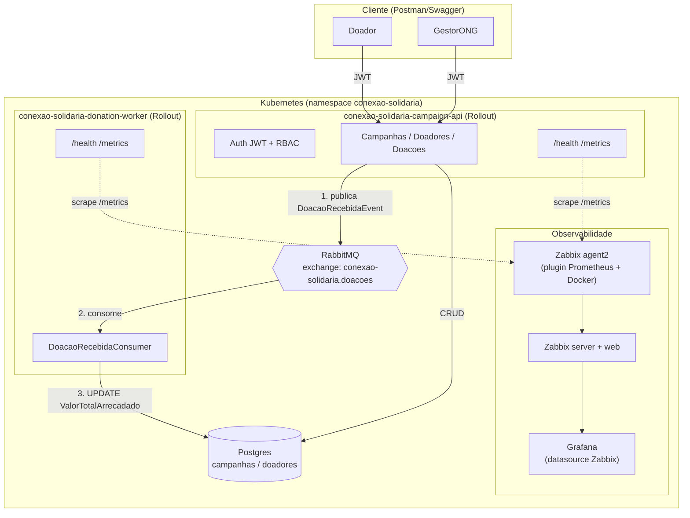

# Diagrama de Arquitetura — Conexão Solidária

## Componentes

| Componente | Repositório | Responsabilidade |
|---|---|---|
| `campaign-api` | [conexao-solidaria-campaign-api](https://github.com/marcarinivinicius/conexao-solidaria-campaign-api) | Auth JWT/RBAC, CRUD de campanhas, cadastro de doadores, painel público, recebe doação e publica evento |
| `donation-worker` | [conexao-solidaria-donation-worker](https://github.com/marcarinivinicius/conexao-solidaria-donation-worker) | Consome `DoacaoRecebidaEvent`, soma o valor arrecadado na campanha |
| `shared` | [conexao-solidaria-shared](https://github.com/marcarinivinicius/conexao-solidaria-shared) | Biblioteca `ConexaoSolidaria.Shared.RabbitMq` (cliente RabbitMQ compartilhado) |
| `infra` | [conexao-solidaria-infra](https://github.com/marcarinivinicius/conexao-solidaria-infra) | Postgres, RabbitMQ, Zabbix, Grafana **e** repo GitOps (manifests `Rollout`/`Application` de cada serviço, sincronizados pelo ArgoCD) |

## Fluxo assíncrono da doação (o ponto central do desafio)

1. Doador autenticado chama `POST /api/v1/doacoes` na `campaign-api`.
2. A API valida a campanha (não pode estar `Concluida`/`Cancelada`) e **não** grava o valor arrecadado — só publica `DoacaoRecebidaEvent` no RabbitMQ (exchange `conexao-solidaria.doacoes`, routing key `doacao-recebida`).
3. O `donation-worker` consome a fila `conexao-solidaria.doacoes.donation-worker` e executa um `UPDATE` atômico somando o valor ao `ValorTotalArrecadado` da campanha.
4. O painel público (`GET /api/v1/campanhas`) passa a refletir o novo total.

Essa separação é o que cumpre o requisito de "comunicação assíncrona e mensageria" do desafio: a escrita do valor arrecadado nunca acontece no mesmo processo/transação que recebe a doação.

## Fluxo de deploy (GitOps: CI → PR → ArgoCD → Argo Rollouts)

```mermaid
flowchart LR
    Dev["Push na main\n(campaign-api ou donation-worker)"]

    subgraph CIRepo["CI do serviço"]
        Build["build + testes"]
        Publish["docker build/push\nghcr.io/.../<app>:sha"]
        OpenPR["abre PR em\nconexao-solidaria-infra\n(kustomize edit set image)"]
    end

    subgraph InfraRepo["conexao-solidaria-infra"]
        PR["PR: bump da tag\nem kustomization.yaml"]
        Merge["merge na main"]
    end

    subgraph Cluster["Kubernetes"]
        ArgoCD["ArgoCD\n(Application, sync automatico)"]
        Rollout["Argo Rollouts\n(kind: Rollout)"]
        Canary["Canary: 20% -> pausa -> 60% -> pausa -> 100%"]
    end

    Dev --> Build --> Publish --> OpenPR --> PR
    PR -->|"revisão + merge"| Merge
    Merge -->|"detecta mudança"| ArgoCD
    ArgoCD -->|"aplica Rollout"| Rollout
    Rollout --> Canary
```

- **`campaign-api`**: canary com `trafficRouting.nginx` — o Argo Rollouts pesa o tráfego HTTP real entre a versão estável e a nova via Ingress.
- **`donation-worker`**: canary **por réplica**, sem `trafficRouting` — não tem Ingress (só consome fila), então o peso é aproximado pela proporção de pods novos vs antigos.
- Não há `AnalysisTemplate` automatizada (decisão registrada em [`conexao-solidaria-infra/infra/argo-rollouts/README.md`](https://github.com/marcarinivinicius/conexao-solidaria-infra/blob/main/infra/argo-rollouts/README.md)): a promoção entre os degraus do canary é manual (`kubectl argo rollouts promote`), não há métrica de erro automatizada decidindo por conta própria — o ambiente não tem Datadog, que é a integração usada no exemplo de referência interno.
- Nenhum `kubectl apply` direto no cluster faz parte do fluxo normal de deploy — só o merge do PR no `conexao-solidaria-infra`.
